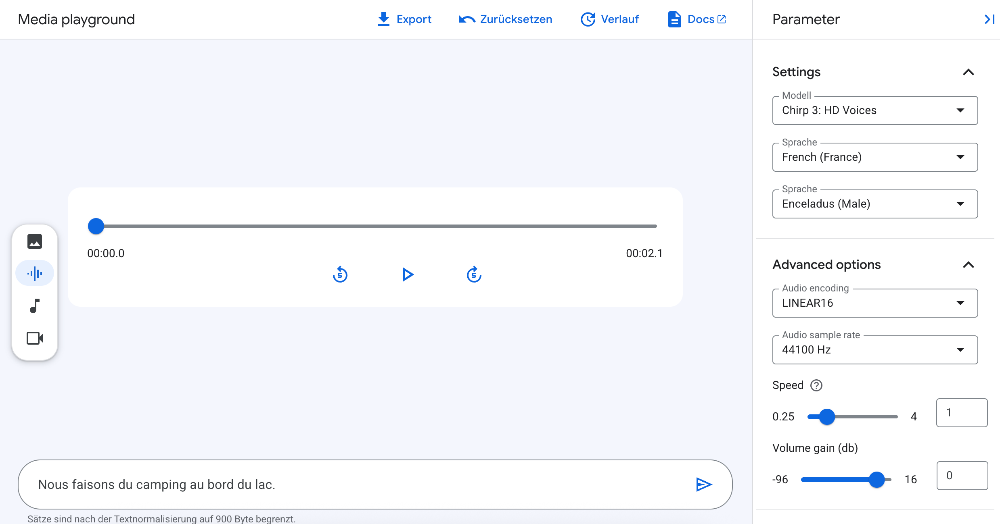

## How to Get the Sound Files
I use TTS (Text To Speech) to generate the sound files used in this project. 
The Google Cloud Text-to-Speech API is used to generate the files, using a variety of voices and languages.

### Setting up Google Cloud TTS
1. Create a Google Cloud account if you don't have one.
2. Create a new project in the Google Cloud Console.
3. Enable the Text-to-Speech API for your project.
4. Set up billing for your project (Google offers a free tier with up to 1.000.000 characters per month (more than enough!) + some free credits).

When using the console, set the settings as follows:

## Favourite Voices:
Very subjective, but these are my favourites:

### Female Voices:
* Autonoe: very sympathetic
* Callirhoe: very clear

### Male Voices:
* Enceladus: deep, sexy <- my personal favourite
* Schelar: clear, youthful
